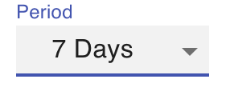
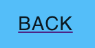

# A simple React “New York Times - Most Popular” website

## Project setup

```
yarn install
```

### Compiles and hot-reloads for development

```
yarn start
```

### Compiles and minifies for production

```
yarn build
```

### Instruction & Screen shot of the project

● Homepage:​ list the most popular articles (Most Viewed by Section & Time Period)


- Period Selector
  
  

● Detail page:​ show the article


● Navigation:​ to go back from the details page to the homepage and vice versa

- Click to a card to show the detail page
  
- Click to go back button in detail page
  

- search form that allows a user to search for articles by a search term/text string


