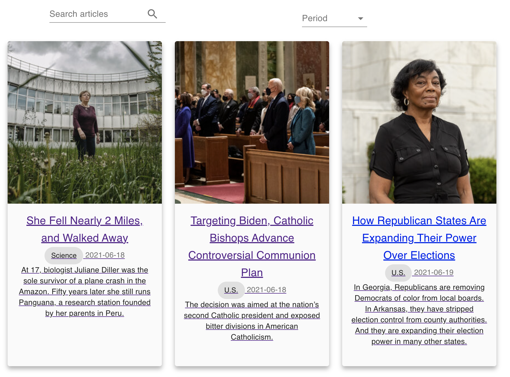

# A simple React “New York Times - Most Popular” website
## Project setup
```
yarn install
```

### Compiles and hot-reloads for development
```
yarn start
```

### Compiles and minifies for production
```
yarn build
```

### Instruction & Screen shot of the project

● Homepage:​ list the most popular articles (Most Viewed by Section & Time Period)


● Detail page:​ show the article


● Navigation:​ to go back from the details page to the homepage and vice versa


search form that allows a user to search for articles by a search term/text string

